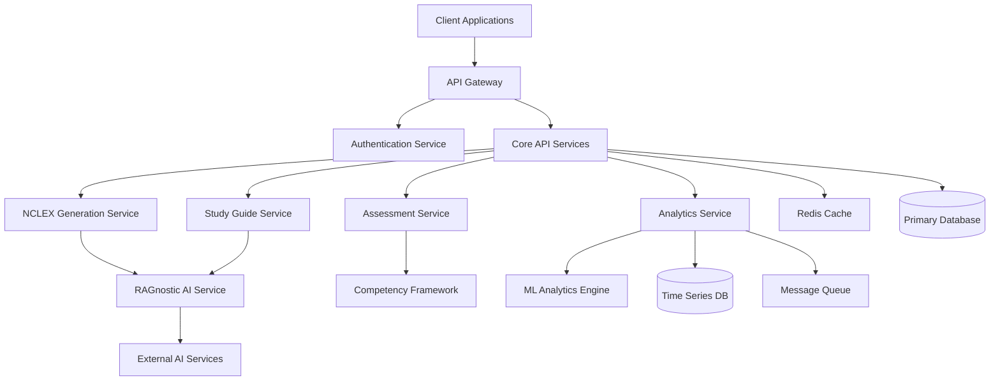
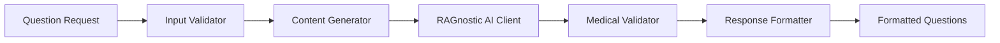
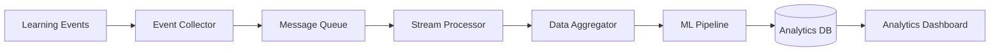
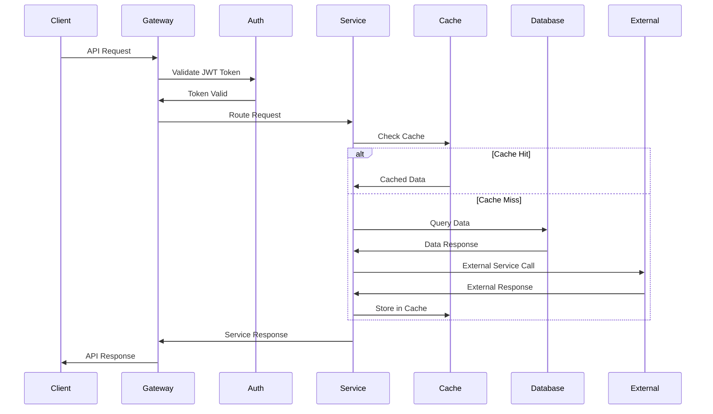
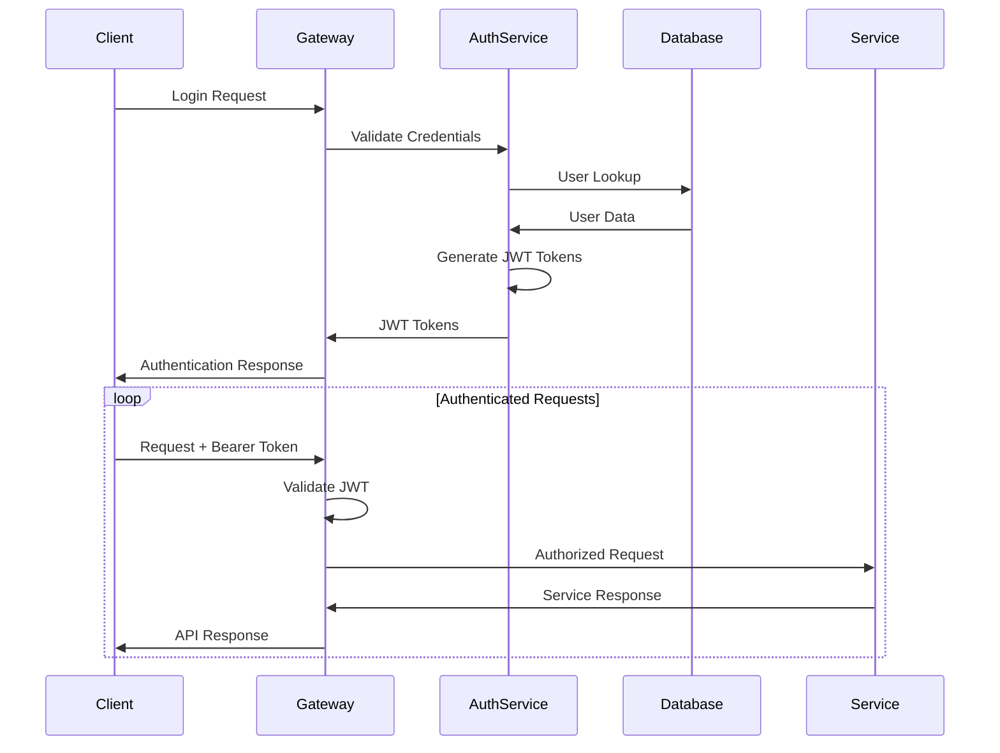

# System Architecture

This document provides a comprehensive overview of the BSN Knowledge API architecture, including system design, components, data flow, and integration patterns.

## Architecture Overview

BSN Knowledge is built as a modern, cloud-native application using a **microservices architecture** with **event-driven patterns** and **API-first design principles**.

### High-Level Architecture



### Core Principles

1. **Microservices Architecture**: Loosely coupled, independently deployable services
2. **API-First Design**: RESTful APIs with OpenAPI specifications
3. **Event-Driven Processing**: Asynchronous communication for scalability
4. **Cloud-Native**: Container-based deployment with orchestration
5. **Security by Design**: JWT authentication, RBAC, and data encryption
6. **Observability**: Comprehensive monitoring, logging, and tracing

## System Components

### 1. API Gateway Layer

**Primary Entry Point** for all client requests with cross-cutting concerns.

**Responsibilities:**
- Request routing and load balancing
- Authentication and authorization
- Rate limiting and throttling
- Request/response transformation
- API versioning
- CORS handling
- SSL/TLS termination

**Technology Stack:**
- **Framework**: FastAPI with uvicorn ASGI server
- **Middleware**: Custom middleware for performance monitoring
- **Security**: JWT token validation and RBAC
- **Documentation**: Automatic OpenAPI generation

**Key Features:**
```python
# Gateway configuration example
app = FastAPI(
    title="BSN Knowledge API Gateway",
    version="1.0.0",
    docs_url="/docs",
    redoc_url="/redoc"
)

# Middleware stack
app.add_middleware(CORSMiddleware, allow_origins=["*"])
app.add_middleware(GZipMiddleware, minimum_size=1000)
app.middleware("http")(performance_monitoring_middleware)
app.middleware("http")(rate_limit_middleware)

# Router registration
app.include_router(auth.router, prefix="/api/v1")
app.include_router(nclex.router, prefix="/api/v1")
app.include_router(assessment.router, prefix="/api/v1")
app.include_router(analytics.router, prefix="/api/v1")
```

### 2. Authentication & Authorization Service

**Centralized security** handling for the entire platform.

**Components:**
- **JWT Token Management**: Access and refresh token lifecycle
- **Role-Based Access Control**: Student, Instructor, Admin roles
- **User Management**: Account creation, password management
- **Session Management**: Secure session handling

**Security Features:**
- **Token Encryption**: HMAC SHA-256 signatures
- **Role Hierarchy**: Hierarchical permission inheritance
- **Rate Limiting**: Brute force protection
- **Audit Logging**: Authentication event tracking

```python
# JWT token structure
{
  "sub": "student1",           # Username
  "user_id": 1,               # Numeric user ID
  "role": "student",          # User role
  "scopes": [],               # Permission scopes
  "iat": 1692873600,          # Issued at
  "exp": 1692875400,          # Expiration
  "type": "access"            # Token type
}
```

### 3. Core Business Services

#### NCLEX Generation Service

**AI-powered question generation** with medical accuracy validation.

**Architecture:**


**Key Components:**
- **Request Validation**: Parameter validation and sanitization
- **Content Generation**: Integration with RAGnostic AI service
- **Medical Validation**: Accuracy checking against clinical guidelines
- **Question Formatting**: Structured question and rationale formatting
- **Caching Layer**: Redis caching for frequently requested topics

**Performance Optimization:**
- **Circuit Breaker**: Fail-fast pattern for external AI service
- **Connection Pooling**: Efficient HTTP connection management
- **Caching Strategy**: Topic-based caching with 5-minute TTL
- **Rate Limiting**: 50 requests per hour per user

#### Assessment Service

**AACN competency evaluation** with detailed analytics and recommendations.

**Core Components:**
```python
class AACNCompetencyFramework:
    """AACN competency assessment framework"""

    def __init__(self, ragnostic_client):
        self.ragnostic_client = ragnostic_client
        self.competency_definitions = self._load_competencies()
        self.assessment_engine = CompetencyAssessmentEngine()

    async def assess_competency(self, student_id, competency_id, performance_data):
        # Multi-dimensional assessment algorithm
        assessment_result = await self.assessment_engine.evaluate(
            competency=self.competency_definitions[competency_id],
            performance_data=performance_data,
            context=await self._get_student_context(student_id)
        )
        return assessment_result
```

**Assessment Algorithm:**
1. **Performance Data Aggregation**: Quiz scores, clinical evaluations, simulations
2. **Competency Mapping**: AACN framework alignment
3. **Proficiency Calculation**: Multi-factor scoring algorithm
4. **Gap Analysis**: Identification of learning deficiencies
5. **Recommendation Generation**: Personalized learning paths

#### Analytics Service

**Comprehensive learning analytics** with predictive modeling.

**Data Pipeline:**


**Analytics Components:**
- **Event Collection**: Real-time learning activity tracking
- **Stream Processing**: Event aggregation and transformation
- **ML Pipeline**: Predictive modeling and pattern recognition
- **Reporting Engine**: Dashboard and report generation
- **Data Export**: CSV, Excel, and API data export

**Key Metrics:**
- Student progress tracking
- Competency development trends
- Learning pattern analysis
- Performance prediction modeling
- Institutional effectiveness metrics

### 4. Data Layer

#### Primary Database

**Relational database** for core application data.

**Schema Design:**
```sql
-- Core entities
CREATE TABLE users (
    id SERIAL PRIMARY KEY,
    username VARCHAR(255) UNIQUE NOT NULL,
    email VARCHAR(255) UNIQUE NOT NULL,
    role VARCHAR(50) NOT NULL,
    hashed_password VARCHAR(255) NOT NULL,
    is_active BOOLEAN DEFAULT true,
    created_at TIMESTAMP WITH TIME ZONE DEFAULT CURRENT_TIMESTAMP
);

CREATE TABLE competency_assessments (
    id UUID PRIMARY KEY DEFAULT gen_random_uuid(),
    student_id INTEGER REFERENCES users(id),
    competency_id VARCHAR(255) NOT NULL,
    proficiency_score DECIMAL(5,2),
    current_level VARCHAR(50),
    assessment_data JSONB,
    created_at TIMESTAMP WITH TIME ZONE DEFAULT CURRENT_TIMESTAMP
);

CREATE TABLE learning_analytics_events (
    id UUID PRIMARY KEY DEFAULT gen_random_uuid(),
    user_id INTEGER REFERENCES users(id),
    event_type VARCHAR(100) NOT NULL,
    event_data JSONB,
    timestamp TIMESTAMP WITH TIME ZONE DEFAULT CURRENT_TIMESTAMP
);

-- Performance indices
CREATE INDEX idx_assessments_student_competency ON competency_assessments(student_id, competency_id);
CREATE INDEX idx_analytics_events_user_time ON learning_analytics_events(user_id, timestamp);
CREATE INDEX idx_analytics_events_type ON learning_analytics_events(event_type);
```

#### Cache Layer

**Redis-based caching** for performance optimization.

**Caching Strategy:**
```python
class CacheManager:
    def __init__(self, redis_client):
        self.redis = redis_client
        self.cache_configs = {
            'nclex_questions': {'ttl': 300, 'prefix': 'nclex:'},
            'student_progress': {'ttl': 600, 'prefix': 'progress:'},
            'competency_data': {'ttl': 1800, 'prefix': 'competency:'},
            'analytics_summary': {'ttl': 900, 'prefix': 'analytics:'}
        }

    async def get_or_set(self, cache_type, key, fetch_function):
        cache_key = f"{self.cache_configs[cache_type]['prefix']}{key}"
        cached_data = await self.redis.get(cache_key)

        if cached_data:
            return json.loads(cached_data)

        fresh_data = await fetch_function()
        await self.redis.setex(
            cache_key,
            self.cache_configs[cache_type]['ttl'],
            json.dumps(fresh_data)
        )
        return fresh_data
```

**Cache Patterns:**
- **Question Generation**: Topic-based caching
- **Student Progress**: User-specific progress data
- **Competency Framework**: Static competency definitions
- **Analytics**: Aggregated metrics and reports

#### Time Series Database

**Specialized storage** for analytics and monitoring data.

**Use Cases:**
- Learning activity metrics
- API performance monitoring
- User engagement tracking
- System health metrics

### 5. External Integrations

#### RAGnostic AI Service

**External AI service** for content generation and analysis.

**Integration Architecture:**
```python
class RAGnosticClient:
    def __init__(self, base_url, api_key, max_retries=3):
        self.base_url = base_url
        self.api_key = api_key
        self.session = httpx.AsyncClient(
            timeout=30,
            limits=httpx.Limits(max_connections=100),
            headers={"Authorization": f"Bearer {api_key}"}
        )
        self.circuit_breaker = CircuitBreaker(
            failure_threshold=5,
            reset_timeout=60
        )

    @retry(max_attempts=3, backoff_factor=2)
    async def generate_content(self, content_type, parameters):
        async with self.circuit_breaker:
            response = await self.session.post(
                f"{self.base_url}/generate",
                json={
                    "content_type": content_type,
                    "parameters": parameters
                }
            )
            return response.json()
```

**Integration Features:**
- **Circuit Breaker**: Fail-fast pattern for resilience
- **Retry Logic**: Exponential backoff for transient failures
- **Connection Pooling**: Efficient connection management
- **Health Monitoring**: Service availability checking

## Data Flow & Processing

### Request Processing Flow



### Event-Driven Processing

**Asynchronous event processing** for analytics and notifications.

```python
# Event publishing
class EventPublisher:
    async def publish_learning_event(self, user_id, event_type, event_data):
        event = {
            "event_id": str(uuid.uuid4()),
            "user_id": user_id,
            "event_type": event_type,
            "event_data": event_data,
            "timestamp": datetime.utcnow().isoformat()
        }

        await self.message_queue.publish("learning_events", event)

# Event processing
class LearningEventProcessor:
    async def process_question_completion(self, event):
        # Update student progress
        await self.update_progress_tracking(event)

        # Trigger analytics processing
        await self.analytics_service.process_question_data(event)

        # Check for competency milestones
        await self.check_competency_milestones(event)
```

## Security Architecture

### Security Layers

1. **Network Security**: HTTPS/TLS encryption, firewall rules
2. **API Security**: JWT authentication, RBAC authorization
3. **Application Security**: Input validation, SQL injection prevention
4. **Data Security**: Encryption at rest, secure key management

### Authentication Flow



### Authorization Model

**Role-Based Access Control (RBAC)** with hierarchical permissions:

```python
class RolePermissions:
    STUDENT = [
        "read:own_progress",
        "create:questions",
        "read:study_guides",
        "create:assessments"
    ]

    INSTRUCTOR = STUDENT + [
        "read:student_progress",
        "create:assignments",
        "read:class_analytics",
        "manage:course_content"
    ]

    ADMIN = INSTRUCTOR + [
        "read:all_users",
        "manage:users",
        "read:system_analytics",
        "manage:system_config"
    ]
```

## Performance & Scalability

### Performance Characteristics

**Target Performance Metrics:**
- **API Response Time**: <500ms for standard operations
- **Content Generation**: <2s for AI-powered content
- **Concurrent Users**: 1,000+ simultaneous users
- **Throughput**: 10,000+ requests per minute
- **Availability**: 99.9% uptime SLA

### Scaling Strategy

**Horizontal Scaling:**
- Stateless application design
- Load balancer distribution
- Container orchestration
- Database read replicas

**Vertical Scaling:**
- CPU-optimized instances for AI processing
- Memory-optimized instances for caching
- Storage-optimized instances for databases

### Caching Strategy

**Multi-Level Caching:**

```python
# Application-level caching
@lru_cache(maxsize=1000)
def get_competency_definition(competency_id):
    return competency_framework.get_competency(competency_id)

# Redis distributed caching
async def get_student_progress(student_id):
    cache_key = f"progress:{student_id}"
    cached = await redis.get(cache_key)

    if cached:
        return json.loads(cached)

    progress = await database.get_student_progress(student_id)
    await redis.setex(cache_key, 600, json.dumps(progress))
    return progress

# CDN caching for static content
# - Study guide templates
# - Question formats
# - UI assets
```

## Monitoring & Observability

### Monitoring Stack

**Application Monitoring:**
- Performance metrics (response times, throughput)
- Error tracking and alerting
- Business metrics (user engagement, content usage)

**Infrastructure Monitoring:**
- Server resource utilization
- Database performance metrics
- Cache hit rates and performance
- External service availability

**Security Monitoring:**
- Failed authentication attempts
- Suspicious API usage patterns
- Rate limit violations
- Data access auditing

### Logging Architecture

```python
# Structured logging
import structlog

logger = structlog.get_logger("bsn_knowledge")

# Request logging
logger.info(
    "api_request_completed",
    method="POST",
    endpoint="/api/v1/nclex/generate",
    user_id=user.id,
    response_time_ms=145,
    status_code=200,
    request_id="req_abc123"
)

# Error logging
logger.error(
    "external_service_error",
    service="ragnostic",
    error_code="CONNECTION_TIMEOUT",
    retry_count=3,
    user_id=user.id,
    request_id="req_abc123"
)
```

### Health Checks

**Multi-Level Health Monitoring:**

```python
class HealthChecker:
    async def comprehensive_health_check(self):
        checks = await asyncio.gather(
            self.check_database_connectivity(),
            self.check_redis_connectivity(),
            self.check_external_services(),
            self.check_system_resources(),
            return_exceptions=True
        )

        return {
            "status": "healthy" if all(checks) else "degraded",
            "components": {
                "database": checks[0],
                "cache": checks[1],
                "external_ai": checks[2],
                "resources": checks[3]
            },
            "timestamp": datetime.utcnow().isoformat()
        }
```

## Deployment Architecture

### Container Strategy

**Docker-based containerization** with multi-stage builds:

```dockerfile
# Multi-stage Dockerfile
FROM python:3.12-slim AS builder
COPY requirements.txt .
RUN pip install --user -r requirements.txt

FROM python:3.12-slim AS runtime
COPY --from=builder /root/.local /root/.local
COPY src/ /app/src/
WORKDIR /app
EXPOSE 8000
CMD ["uvicorn", "src.api.main:app", "--host", "0.0.0.0", "--port", "8000"]
```

### Orchestration

**Kubernetes deployment** with horizontal pod autoscaling:

```yaml
apiVersion: apps/v1
kind: Deployment
metadata:
  name: bsn-knowledge-api
spec:
  replicas: 3
  selector:
    matchLabels:
      app: bsn-knowledge-api
  template:
    metadata:
      labels:
        app: bsn-knowledge-api
    spec:
      containers:
      - name: api
        image: bsn-knowledge/api:latest
        ports:
        - containerPort: 8000
        resources:
          requests:
            cpu: 200m
            memory: 512Mi
          limits:
            cpu: 500m
            memory: 1Gi
        env:
        - name: DATABASE_URL
          valueFrom:
            secretKeyRef:
              name: db-credentials
              key: url
---
apiVersion: v1
kind: Service
metadata:
  name: bsn-knowledge-api-service
spec:
  selector:
    app: bsn-knowledge-api
  ports:
  - port: 80
    targetPort: 8000
  type: LoadBalancer
```

## Future Architecture Considerations

### Planned Enhancements

1. **Microservice Decomposition**: Further service separation
2. **Event Sourcing**: Event-driven state management
3. **GraphQL API**: Flexible query capabilities
4. **Real-time Features**: WebSocket support for live updates
5. **Multi-tenancy**: Institution-specific data isolation

### Scalability Roadmap

1. **Database Sharding**: Horizontal database partitioning
2. **CQRS Implementation**: Command-query responsibility segregation
3. **Edge Computing**: CDN-based edge processing
4. **AI Model Deployment**: On-premise AI model serving

---

**Related Documentation:**
- [Database Schema](database-schema.md) - Detailed data models
- [Security Architecture](security.md) - Security implementation details
- [Performance Guide](performance.md) - Performance optimization strategies
- [Deployment Guide](deployment.md) - Production deployment instructions
